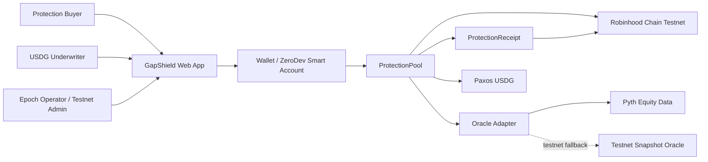
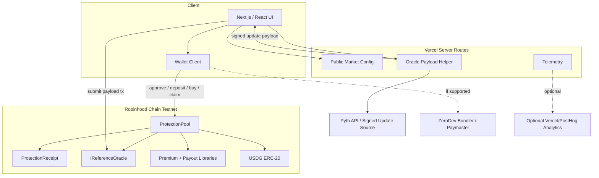
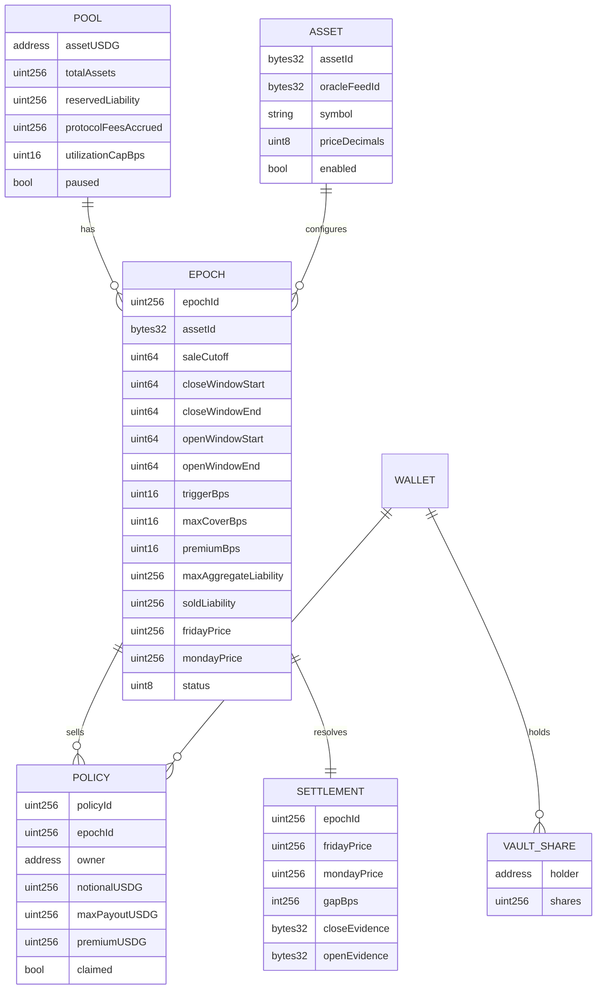
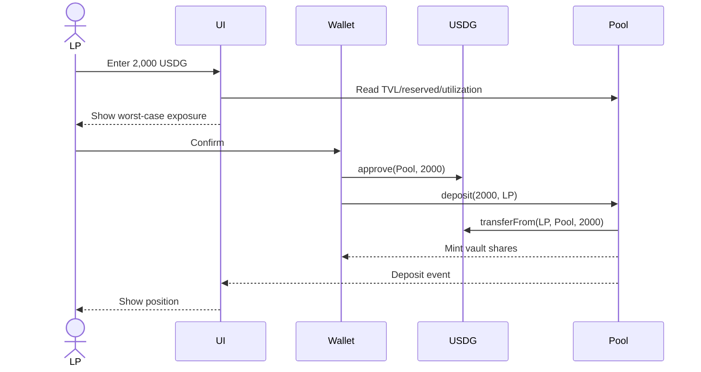
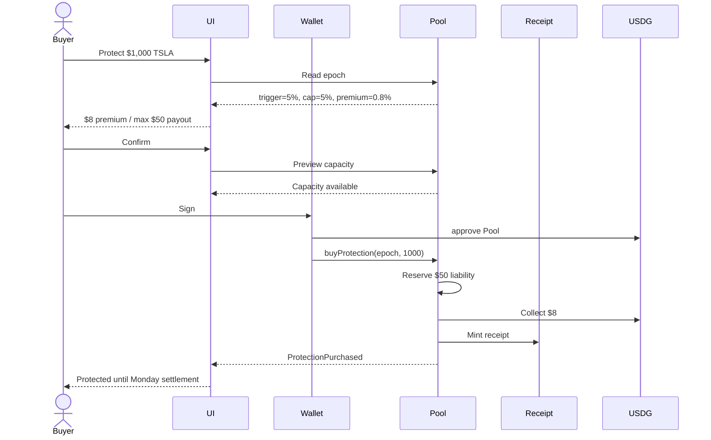
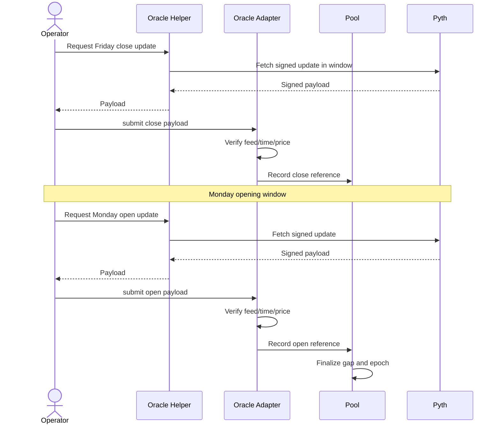

<!-- PRODUCT_ARCHITECTURE.md -->
# GapShield — Product Architecture
Version 0.1 · 2026-10-01 · Hackathon MVP technical source of truth · Owner: GapShield team

## 1. Overview

GapShield is a mobile-first web application and a small set of EVM smart contracts that sell fully collateralized, fixed-price protection against a defined Friday-close-to-Monday-open downside gap in a tokenized equity. Underwriters deposit USDG into an ERC-4626-style protection pool; buyers purchase a policy before a hard cutoff; the pool reserves the policy’s maximum possible payout; an oracle adapter records the authorized Friday and Monday reference prices; settlement computes the gap and claimable payout deterministically; the policy owner claims USDG. Robinhood Chain Testnet is the primary hackathon deployment, with Arbitrum Sepolia as an optional mirror.

### Architecture goals ranked by priority

1. **Correct solvency and payout math.** Never sell protection the pool cannot pay.
2. **Ship a real end-to-end testnet product before the deadline.**
3. **Make oracle settlement explicit, auditable, and replaceable.**
4. **Keep the buyer experience simpler than an options interface.**
5. **Make contract behavior easy to test and explain to judges.**
6. **Keep the system cheap to change after the hackathon.**
7. **Avoid infrastructure that does not improve the core proof.**

### Non-goals

The MVP does not include:
- a full options protocol;
- a secondary market for policies;
- an AMM or order book;
- leverage or undercollateralized underwriting;
- dynamic market-making;
- cross-chain liquidity;
- LP tranches;
- governance token or DAO;
- upgradeable proxy system;
- custom bridge;
- Kubernetes, microservices, Redis, queues, or event sourcing;
- production KYC/compliance stack;
- AI/ML;
- production mainnet retail launch.

## 2. Architecture Principles

1. **Worst-case liability is reserved at purchase.** Solvency is a contract invariant, not an operational policy.
2. **The chain is the canonical financial state.** Policy state, pool collateral, settlement, and claims live on-chain.
3. **Oracle logic stays behind an interface.** The pool knows what a valid settlement means, not how every oracle vendor transports data.
4. **Sales stop before information arrives.** No policy can be created after the epoch cutoff.
5. **Receipts identify claims; they do not create a trading venue.** Policy receipts are non-transferable in v1.
6. **No floating point.** Percentages and prices use fixed-point integer math with explicit decimals and basis points.
7. **External integrations cannot block the core demo.** ZeroDev and production-grade equity oracle integrations have explicit, visible testnet fallbacks.
8. **Boring deployment wins.** Solidity + Foundry + OpenZeppelin + Next.js + viem. Stylus is deferred until the Solidity product works.

## 3. System Context



### External dependencies

**Robinhood Chain Testnet**

Primary network. Robinhood documents Robinhood Chain as an Arbitrum L2 using Ethereum for data availability, with testnet chain ID `46630`, ETH gas, public RPC `https://rpc.testnet.chain.robinhood.com`, and explorer `https://explorer.testnet.chain.robinhood.com`. The chain is EVM-compatible and standard Solidity/Foundry deployments require no custom contract language.

**Paxos USDG**

Single collateral, premium, and payout asset.

Current official testnet addresses:
- Robinhood Testnet: `0x7E955252E15c84f5768B83c41a71F9eba181802F`
- Arbitrum Sepolia: `0xFFC95faa3d63Cde504a05B567C600B78C0b41892`

Re-verify from Paxos immediately before deployment.

**Pyth**

Preferred settlement oracle. Pyth Pro currently lists the same EVM contract address on Robinhood Chain, Robinhood Chain Testnet, Arbitrum One, and Arbitrum Sepolia:

`0xACeA761c27A909d4D3895128EBe6370FDE2dF481`

This proves deployment, not that the exact equity feed and access plan required by GapShield are available. That must be verified during Phase 0.

**ZeroDev**

Preferred passkey/smart-account/gas-sponsorship layer. It is not a critical dependency until hosted bundler/paymaster support for Robinhood Chain Testnet is verified. Standard EOA/injected-wallet flow remains the launch fallback.

**Vercel**

Hosts the Next.js app and optional server routes for oracle payload acquisition and telemetry. Frontend/server downtime must not change already recorded on-chain financial state.

## 4. High-Level Architecture



### Component responsibilities

**ProtectionPool**
- holds USDG;
- mints/burns vault shares;
- tracks `reservedLiability`;
- enforces `freeCollateral`;
- creates and opens weekly epochs;
- accepts premium;
- reserves maximum payout;
- blocks post-cutoff purchases;
- computes claimable payout from settled epoch data;
- pays claims;
- limits LP withdrawal to unreserved collateral;
- exposes solvency/utilization views.

**ProtectionReceipt**
- unique receipt per policy;
- non-transferable in v1;
- ownership identifies claimant;
- stores no pricing or settlement logic;
- metadata derives from pool policy data.

**IReferenceOracle**
- validates/records the reference for a specific feed and allowed time window;
- checks feed ID, publish time, positivity, and one-time settlement;
- production candidate: Pyth adapter;
- testnet fallback: explicit `SnapshotOracle`.

**Premium library**
- v1 reads fixed premium basis points from epoch configuration;
- no stochastic model or live volatility dependency.

**Payout library**
- pure integer math;
- downside gap only;
- trigger + maximum cover cap;
- heavily unit/fuzz tested.

**Next.js UI**
- buyer journey;
- underwriter journey;
- payout scrubber;
- contract reads/writes;
- transaction/explorer links;
- explicit demo-mode labeling.

**Optional server routes**
- fetch signed oracle data where API keys cannot be exposed;
- expose non-sensitive public config;
- receive privacy-safe analytics;
- never own policy state, pool accounting, or claim authority.

### Communication patterns

- Browser ↔ chain: JSON-RPC using viem.
- Browser ↔ Vercel routes: HTTPS REST.
- Server ↔ oracle API: HTTPS.
- No GraphQL.
- No app-owned WebSocket required.
- No queues.
- Contract events are read on demand.

## 5. Tech Stack

| Layer | Choice | Alternatives considered | Reason |
|---|---|---|---|
| Smart contracts | Solidity 0.8.x + Foundry | Hardhat, Stylus | Fastest path to rigorous tests |
| Contract libraries | OpenZeppelin | Custom primitives | Mature ERC/access/security components |
| Primary chain | Robinhood Chain Testnet | Arbitrum Sepolia | Strongest product narrative + reserved prize path |
| Mirror chain | Arbitrum Sepolia if time | None | Backup Arbitrum deployment |
| Collateral | Paxos USDG | USDC | Natural product fit + hackathon bonus |
| Oracle abstraction | `IReferenceOracle` | Hardcoded vendor logic | Allows real oracle + demo fallback |
| Preferred oracle | Pyth equity feed | Chainlink | Current Robinhood/Arbitrum deployment + equity support |
| Demo oracle | `SnapshotOracle` | Backend-only price DB | Deterministic, transparent testnet path |
| Frontend | Next.js 16 + React 19 + TypeScript | Vite SPA | UI + optional server routes in one app |
| Styling | Tailwind CSS 4 | CSS Modules | Fast consistent mobile implementation |
| EVM client | viem | ethers.js | Typed modern EVM interface |
| Wallet | wagmi-compatible connector; ZeroDev feature flag | Custom wallet | No custody; AA only where it improves UX |
| App auth | Wallet identity | Email/password | No account DB needed |
| Backend | Next.js server routes only | Express/Fastify | Avoid second deployment |
| Database | None | Postgres | On-chain state is sufficient in MVP |
| Cache | None | Redis | No launch need |
| Search | None | Elasticsearch | No searchable corpus |
| Storage | Static app assets | S3 | No user-generated files |
| AI/ML | None | — | Not relevant |
| Hosting | Vercel | Render/Cloudflare | Fastest deployment |
| RPC | Public Robinhood RPC, free provider fallback | Own node | $0 constraint |
| CI | GitHub Actions | Custom CI | Standard and reproducible |
| Analytics | Vercel Analytics; PostHog only if useful | Custom DB | Low setup cost |
| Error monitoring | Vercel logs; Sentry free optional | Custom stack | Enough for hackathon |

## 6. Feature-to-Component Map

| MVP feature | Components | User job |
|---|---|---|
| Deposit USDG | ProtectionPool, USDG, wallet UI | Underwrite bounded risk |
| Show free/reserved collateral | Pool views, SolvencyBar | Understand worst-case exposure |
| Fixed quote | Epoch config, premium library, buyer UI | Know exact premium/payout terms |
| Buy before cutoff | Pool, wallet | Lock weekend protection |
| Policy receipt | ProtectionReceipt | Prove claim ownership |
| Record Friday reference | Oracle adapter | Define reference start |
| Record Monday open | Oracle adapter | Resolve event |
| Calculate payout | Payout library, pool | Deterministic settlement |
| Claim USDG | Pool, USDG | Receive payout |
| Pause | Pool access control | Stop new risk during failure |
| Demo mode | SnapshotOracle, banner, admin controls | Show complete lifecycle |
| Passkey/gasless | ZeroDev | Reduce friction; not critical path |
| Production-like oracle | Pyth adapter/server helper | Demonstrate credible settlement |

## 7. Data Architecture

The hackathon MVP has no application database. Product state is on-chain.

### Domain relationships



### Key fields

#### Pool

- immutable USDG token;
- `reservedLiability`;
- `protocolFeesAccrued`;
- `utilizationCapBps` default 5000;
- paused flag.

`freeCollateral = totalAssets - reservedLiability - protocolFeesAccrued`

#### Epoch

One explicit weekend:
- asset/feed;
- sale cutoff;
- reference windows;
- trigger;
- cap;
- premium;
- max aggregate liability;
- sold liability;
- settlement prices/status.

Explicit timestamps are intentional: they avoid building a full NYSE holiday/DST calendar into the 70-hour MVP.

#### Policy

Economic terms become immutable at purchase:
- epoch;
- owner;
- notional;
- max payout;
- premium;
- claimed flag.

### Payout math

Let:
- `Fc` = Friday reference price;
- `Mo` = Monday reference price;
- `T` = trigger bps;
- `C` = cover cap bps;
- `N` = USDG notional.

Downside gap:

`gapBps = max(((Fc - Mo) * 10,000) / Fc, 0)`

Covered gap:

`coveredBps = min(max(gapBps - T, 0), C)`

Payout:

`payout = (N * coveredBps) / 10,000`

Example:
- Friday 100;
- Monday 91;
- gap 9%;
- trigger 5%;
- cap 5%;
- notional 1,000 USDG;
- payout 40 USDG.

All division rounds down.

### Maximum liability

At purchase:

`maxPayout = (N * C) / 10,000`

Purchase succeeds only if:
1. epoch sale is open;
2. `block.timestamp < saleCutoff`;
3. contract not paused;
4. notional valid;
5. `reservedLiability + maxPayout <= totalAssets * utilizationCapBps / 10,000`;
6. free collateral remains sufficient.

The purchase transaction atomically:
- transfers premium;
- increments reserved liability;
- increments epoch sold liability;
- creates policy;
- mints receipt.

### LP accounting choice

MVP uses **one active protection epoch at a time**.

To avoid share-value timing games:
- new LP deposits close when policy sales close;
- LP withdrawals are limited to free collateral and may be fully locked from sale cutoff until epoch settlement for MVP simplicity;
- overlapping active epochs are not supported.

This is intentionally conservative.

### Data ownership / retention / deletion

- Financial state is public/immutable on-chain.
- No names, emails, phone numbers, or KYC data in contracts.
- Third-party analytics must not receive raw wallet addresses without explicit consent.
- Demo/testnet transactions remain public.
- No app DB means no personal profile deletion workflow is required in MVP.

### Analytics events

| Event | Properties |
|---|---|
| `protection_quote_viewed` | asset, notionalBand, triggerBps, premiumBps |
| `payout_scrubber_used` | asset, scenarioGapBps |
| `purchase_started` | asset, notionalBand |
| `purchase_succeeded` | asset, premiumBand, txHash |
| `purchase_failed` | errorCode |
| `underwriter_deposit_started` | amountBand |
| `underwriter_deposit_succeeded` | amountBand, txHash |
| `settlement_viewed` | epochId, triggered |
| `claim_started` | policyId |
| `claim_succeeded` | payoutBand, txHash |
| `demo_scenario_run` | calm_or_gap |

## 8. API Design

### Style and versioning

The contract ABI is the primary API.

HTTP routes exist only where a server is useful and are versioned `/api/v1`.

### HTTP endpoints

| Method | Path | Purpose | Auth |
|---|---|---|---|
| GET | `/api/v1/config` | network, addresses, feature flags | none |
| GET | `/api/v1/markets/:assetId` | human-readable epoch metadata | none |
| POST | `/api/v1/oracle/close-update` | fetch close update payload | admin/testnet gated |
| POST | `/api/v1/oracle/open-update` | fetch open update payload | admin/testnet gated |
| POST | `/api/v1/telemetry` | optional product event | rate-limited |

Remove oracle HTTP routes if the chosen oracle flow does not need a secret.

### Contract operations

```text
deposit(uint256 assets, address receiver)
withdraw(uint256 assets, address receiver, address owner)
createEpoch(EpochConfig config)
buyProtection(uint256 epochId, uint256 notional)
settleClose(uint256 epochId, bytes updateData)
settleOpen(uint256 epochId, bytes updateData)
claim(uint256 policyId)
pause()
unpause()
```

### Worked request/response example

The browser reads:
- epoch 7;
- TSLA;
- trigger 500 bps;
- cap 500 bps;
- premium 80 bps;
- user chooses 1,000 USDG notional.

Display object:

```json
{
  "epochId": "7",
  "asset": "TSLA",
  "notional": "1000.00",
  "triggerPercent": "5.00",
  "maxCoverPercent": "5.00",
  "premiumPercent": "0.80",
  "premiumUSDG": "8.00",
  "maxPayoutUSDG": "50.00",
  "saleCutoff": "2026-10-02T19:55:00Z"
}
```

For 6-decimal USDG the transaction calls:

`buyProtection(7, 1000000000)`

Expected event:

```text
ProtectionPurchased(
  policyId,
  epochId,
  buyer,
  notional,
  premium,
  maxPayout
)
```

### Error format

```json
{
  "error": {
    "code": "ORACLE_UPDATE_UNAVAILABLE",
    "message": "The reference update could not be fetched.",
    "retryable": true
  },
  "requestId": "req_..."
}
```

Stable client error codes:
- `SALE_CLOSED`
- `POOL_CAPACITY_EXCEEDED`
- `INSUFFICIENT_USDG`
- `INVALID_EPOCH`
- `INVALID_REFERENCE_WINDOW`
- `ORACLE_UPDATE_UNAVAILABLE`
- `POLICY_ALREADY_CLAIMED`
- `NO_PAYOUT`
- `CHAIN_UNAVAILABLE`

### Rate limiting

Server only:
- oracle helper: 10 req/min/IP;
- telemetry: 60 req/min/IP.

The contract does not implement artificial per-address rate limits.

## 9. Key Flows

### Underwriter deposit



### Magic moment: buy protection



### Settlement



### Claim

```mermaid
sequenceDiagram
    actor Buyer
    participant UI
    participant Pool
    participant Receipt
    participant USDG

    Buyer->>UI: Open policy
    UI->>Pool: previewPayout(policy)
    Pool-->>UI: 40 USDG claimable
    UI-->>Buyer: Friday $100 → Monday $91 → $40
    Buyer->>Pool: claim(policyId)
    Pool->>Receipt: Verify owner
    Pool->>Pool: Mark claimed; release liability
    Pool->>USDG: transfer 40 USDG
    Pool-->>UI: ProtectionClaimed
```

## 10. Frontend & Experience Architecture

### Navigation map

```text
/
├─ Protect
│  ├─ Quote
│  ├─ Review
│  └─ My Protection
├─ Underwrite
│  ├─ Pool
│  └─ My Position
├─ How it works
└─ Demo Mode
```

The default route is Protect. Do not build a dashboard full of unrelated cards.

### State management

- Chain state: wagmi/TanStack Query or direct viem query wrapper.
- Form state: local React state; React Hook Form only if needed.
- No Redux/Zustand.
- Transaction state:
  `idle → awaiting_signature → pending_chain → confirmed | failed`.

### Design system

Tokens:
- warm neutral or deep ink background;
- one accent;
- accessible green for protected/safe state;
- amber/red for trigger/risk;
- 8px spacing;
- 12–16px radii;
- tabular numerals for finance.

Components:
- `ProtectionQuoteCard`
- `PayoutScrubber`
- `SolvencyBar`
- `MarketClock`
- `PolicyCard`
- `TransactionStatus`
- `RiskDisclosure`
- `DemoModeBanner`

### Dark mode

System dark mode is optional. Do not create two separately tuned themes before the core product ships.

### Performance budgets

- LCP <2.5s on mid-tier mobile/4G.
- INP <200ms.
- Local payout calculator <50ms.
- Initial JS <250KB gzip target excluding wallet/account-abstraction SDK.
- No blocking analytics.
- Wallet SDK lazy-loaded when possible.

### Low-bandwidth / low-end devices

- render product explanation before wallet hydration;
- no required charting library;
- cache public market config;
- lazy-load wallet integrations;
- use text/numbers instead of live market charts;
- compress images and avoid video backgrounds.

### Motion

- 150–250ms state transitions;
- use motion to explain settlement math;
- support `prefers-reduced-motion`;
- no celebratory confetti on loss payouts.

## 11. Security & Privacy

### Authentication / authorization

No app account DB.

Economic actions use wallet signatures/transactions.

Testnet roles:
- admin: `Ownable2Step` or narrowly scoped AccessControl;
- pauser;
- settlement operator only if required by oracle submission flow.

Claims require receipt ownership.

Post-mainnet:
- multisig admin;
- timelocked/risk-bounded configuration;
- permissionless settlement when oracle permits.

### Threat model

| Threat | Control |
|---|---|
| Insolvency | Reserve max payout at purchase; utilization cap |
| LP withdraws reserved funds | `maxWithdraw/maxRedeem` based on free collateral |
| Reentrancy | CEI + ReentrancyGuard |
| Oracle replay | Each reference set once; evidence hash stored |
| Wrong feed | Epoch binds feed ID |
| Stale/out-of-window price | Enforce publish-time bounds |
| Invalid price | Reject nonpositive/invalid values |
| Double settlement | State machine |
| Post-news purchase | Hard sale cutoff |
| Precision loss | Integer math, explicit decimals, round payout down |
| Fee accounting bug | Separate protocol fee from LP assets |
| Epoch config mutation | Freeze economic config once sales open |
| Admin abuse | Testnet only; narrow roles; post-mainnet multisig/timelock |
| Frontend spoof | Contract/network visibility + explorer links |
| Fake USDG | Immutable official token address |
| Gas griefing | No loops over all policies |
| Tiny-policy spam | Minimum notional |
| Corporate action/split | Pause affected asset; out of v1 |

### Encryption / secrets

- TLS everywhere off-chain.
- Oracle/ZeroDev API secrets server-side only.
- No private keys in repo/frontend.
- Deployer key in local secure store or CI secret only.
- `.env.example` contains names, not credentials.

### Compliance

The testnet prototype does not claim regulatory approval.

Before mainnet:
- specialist Singapore/MAS analysis for derivatives/capital-markets perimeter;
- jurisdiction-by-jurisdiction distribution review;
- GDPR/UK GDPR if personal data is added;
- Nigeria data-protection obligations for Nigerian users;
- AML/KYC/sanctions review depending on distribution model.

### Privacy by design

- no PII DB;
- do not send raw wallet addresses to third-party analytics by default;
- do not collect off-chain stock holdings;
- chain data is public by design.

## 12. Scalability, Reliability & Performance

### Expected load

Hackathon:
- <1,000 users;
- <500 policies;
- one active epoch.

Early mainnet:
- 10k users;
- 10k–50k policies/week;
- 10–50 assets.

100x:
- 1M users;
- B2B bulk protection;
- multiple pools.

### Scaling strategy

**Contracts**
- claim O(1);
- settlement O(1) per epoch;
- no loop over policies;
- no loop over LPs.

**Frontend**
- CDN/static delivery;
- multicall/batched reads where useful.

**Indexing**
- none in MVP;
- add managed indexer only when event volume makes direct logs impractical.

**Oracle**
- one close + one open reference per epoch/asset, not high-frequency streaming.

### SLOs

Hackathon:
- 99.5% frontend target;
- p95 chain-read experience <2s where RPC allows.

Post-mainnet:
- 99.9% frontend/API;
- settlement submitted within 5 minutes of valid opening reference where data exists;
- solvency invariant 100%.

### Error budget

Zero tolerance for:
- uncollateralized policy sale;
- wrong payout;
- unauthorized claim;
- invalid settlement.

Frontend downtime is recoverable.

### Backup / DR

- chain is durable financial state;
- code + ABI + addresses in GitHub;
- Vercel redeploy from Git;
- frontend RTO 2 hours;
- on-chain RPO 0;
- analytics RPO up to 24h accepted.

## 13. Observability

### Contract events

Emit:
- `LiquidityDeposited`
- `LiquidityWithdrawn`
- `EpochCreated`
- `ProtectionPurchased`
- `CloseSettled`
- `OpenSettled`
- `EpochSettled`
- `ProtectionClaimed`
- `Paused`
- `Unpaused`

Events include IDs/amounts needed to reconstruct state.

### Logs

Server/frontend structured fields:
- request ID;
- network;
- route;
- oracle operation;
- transaction hash;
- error code;
- duration.

Never log:
- private keys;
- passkey credentials;
- wallet signatures;
- API secrets.

### Metrics dashboard

- TVL;
- reserved liability;
- free collateral;
- utilization;
- policies sold;
- premium collected;
- payouts;
- settlement state.

### Alerts post-mainnet

- utilization exceeds risk threshold;
- settlement delayed;
- pause invoked;
- RPC error rate >5%;
- invariant monitor discrepancy.

## 14. AI / ML Architecture (include only if relevant)

Not relevant.

GapShield uses no AI/ML in its executable path. Historical gap analysis can be an offline notebook but is not a runtime dependency.

## 15. Infrastructure & DevOps

### Environments

**Local**
- Anvil;
- MockUSDG;
- SnapshotOracle;
- deterministic scenarios.

**Staging**
- Robinhood Chain Testnet;
- official Paxos test USDG;
- SnapshotOracle first;
- Pyth adapter if verified.

**Optional mirror**
- Arbitrum Sepolia.

**Production**
- out of hackathon scope.

### CI/CD pipeline

GitHub Actions:
1. `forge fmt --check`
2. `forge build`
3. `forge test`
4. fuzz tests
5. frontend lint
6. TypeScript typecheck
7. frontend tests
8. production build
9. `git diff --check`

Tagged testnet release:
- manual deploy script;
- deployment JSON committed;
- verify contracts where explorer supports it;
- Vercel deployment uses checked-in addresses.

### Infrastructure as code

No Terraform.

Infrastructure is represented by:
- Foundry deploy scripts;
- chain config;
- Vercel config;
- `.env.example`.

### Feature flags

- `NEXT_PUBLIC_DEMO_MODE`
- `NEXT_PUBLIC_ZERODEV_ENABLED`
- `NEXT_PUBLIC_PYTH_ENABLED`
- `NEXT_PUBLIC_CHAIN_ID`

Demo mode must never silently activate on a future mainnet build.

### Release strategy

- no proxies;
- redeploy on breaking financial logic change;
- tag every deployment;
- freeze contracts ≥6 hours before recording final demo if possible.

## 16. Testing & Quality Strategy

### Unit tests

Payout:
- no gap;
- exactly trigger;
- trigger + 1 bp;
- between trigger and cap;
- beyond cap;
- extreme prices;
- rounding.

Premium:
- correct bps;
- min/max notional;
- protocol fee split.

Epoch:
- no purchase after cutoff;
- no economic mutation after open;
- close/open set once;
- valid window enforcement.

Vault:
- deposit/share conversion;
- reserved-liability withdrawal block;
- premium accounting;
- claim liability release.

### Fuzz tests

Fuzz:
- Friday price > 0;
- Monday price;
- notional;
- trigger 0–5000 bps;
- cap 1–5000 bps.

Properties:
- payout ≤ max payout;
- payout = 0 when gap ≤ trigger;
- payout is monotonic with adverse gap until cap;
- reserved liability never underflows;
- no policy causes utilization cap breach.

### Invariant tests

1. `reservedLiability <= claim-supporting collateral`.
2. LP withdrawal never reduces collateral below reserve.
3. A policy cannot claim twice.
4. Non-owner cannot claim.
5. Sold max liability cannot exceed pool/epoch limits.
6. Settled references cannot be changed.
7. Claims cannot exceed policy max payout.

### Integration tests

- official Paxos test USDG interaction;
- oracle adapter;
- full calm weekend;
- full −12% gap;
- pause during active policy;
- failed oracle update;
- receipt ownership.

### End-to-end

Playwright:
1. deposit;
2. buy;
3. settle;
4. claim;
5. verify displayed values match chain.

### Accessibility

- axe scan;
- keyboard purchase;
- screen-reader labels;
- reduced motion;
- 200% zoom.

### Security

Before submission:
- Slither if setup time permits;
- manual checklist;
- adversarial code review;
- every accepted finding gets a regression test;
- no mainnet funds.

### Definition of done

A financial feature is done only when:
- behavior specified;
- unit/failure tests pass;
- UI matches contract terms;
- real testnet transaction succeeds;
- README limitation updated;
- lint/typecheck/build green;
- diff clean.

## 17. Cost Model

### Hackathon

| Item | Cost | Notes |
|---|---:|---|
| Vercel | $0 | free tier |
| GitHub | $0 | free tier |
| Robinhood testnet gas | $0 | faucet/test ETH |
| USDG test token | $0 | no value |
| RPC | $0 | public/free provider |
| ZeroDev | $0–variable | sponsorship may require credits/card |
| Pyth | $0–variable | access tier must be verified |
| Domain | $0–20 | optional |
| Required total | **$0** | standard wallet + demo oracle fallback |

### At 10k users

Directional software cost:
- web/server: $20–100/month;
- RPC/indexing: $50–300;
- monitoring: $0–100;
- oracle/data: potentially largest software line;
- gas subsidy: usage-dependent.

### At 100k users

Software infra remains likely hundreds to low-thousands/month before sponsored gas and data licensing.

The dominant real-world costs will likely be:
- audits;
- legal/regulatory work;
- risk capital/liquidity operations;
- oracle/data licensing;
- potentially insurance and compliance.

### Cost levers

- no gas sponsorship until it proves activation uplift;
- one settlement update per epoch;
- no redundant on-chain storage;
- add indexer only when needed;
- negotiate B2B oracle/data economics before mainnet.

## 18. Delivery Roadmap

Planning assumption: one primary builder + AI coding support; 1–2 additional humans allow parallel work.

### Phase 0 — Decision freeze (Hours 0–3)

Scope:
- register/confirm deadline;
- verify Robinhood testnet;
- verify USDG;
- verify Pyth feed path;
- choose asset;
- freeze economic terms.

Exit:
- network/token/oracle choices documented;
- no unresolved item can change storage layout.

### Phase 1 — Contract core (Hours 3–15)

Scope:
- MockUSDG;
- pool/vault;
- epoch config;
- fixed premium;
- purchase;
- liability reserve;
- receipt;
- payout;
- claim;
- pause.

Exit:
- unit/fuzz/invariants green.

### Phase 2 — Settlement + testnet (Hours 15–25)

Scope:
- oracle interface;
- SnapshotOracle;
- Pyth adapter if verified;
- Robinhood deployment;
- official USDG interaction.

Exit:
- deposit → buy → settle → claim works on testnet.

This is the **submission viability checkpoint**.

### Phase 3 — Buyer experience (Hours 25–38)

Scope:
- mobile protect page;
- payout scrubber;
- wallet;
- quote/review/purchase;
- policy view;
- claim.

Exit:
- first-time user can buy cover in <90 seconds.

### Phase 4 — Underwriter + polish (Hours 38–50)

Scope:
- deposit/withdraw;
- solvency bar;
- pool metrics;
- precise copy;
- error states;
- accessibility;
- ZeroDev only if core is green.

Exit:
- buyer + LP lifecycle complete.

### Phase 5 — Proof + submission assets (Hours 50–62)

Scope:
- real testnet transactions;
- explorer links;
- contract verification;
- README;
- historical gap analysis;
- screenshots;
- demo script/pitch.

Exit:
- reviewer can reproduce from README.

### Phase 6 — Freeze + submit (Hours 62–70)

Scope:
- adversarial review;
- release blockers only;
- record demo;
- complete HackQuest form;
- test every link.

Exit:
- submitted at least two hours before official cutoff.

### Critical path

```text
USDG/network verification
        ↓
solvency-correct pool
        ↓
settlement oracle
        ↓
Robinhood testnet E2E
        ↓
buyer UI
        ↓
demo + submission
```

Not critical:
- Stylus;
- ZeroDev;
- multiple stocks;
- Arbitrum Sepolia mirror.

## 19. Architecture Decision Records

### ADR-001 — Fully collateralized pool

**Context:** Weekend gaps are discontinuous.  
**Decision:** Reserve each policy’s maximum payout at purchase.  
**Alternatives:** Fractional reserve, dynamic liquidation, external reinsurance.  
**Consequences:** Lower capital efficiency, much simpler insolvency reasoning.

### ADR-002 — Explicit weekly epochs

**Context:** DST, holidays, and early closes make market calendars nontrivial.  
**Decision:** Store explicit cutoff/close/open windows per epoch.  
**Alternatives:** Full on-chain exchange calendar; backend-only logic.  
**Consequences:** Operator config matters, but contract logic stays small.

### ADR-003 — Non-transferable protection receipt

**Context:** Transferable NFTs create a secondary derivative market.  
**Decision:** Mint unique non-transferable receipts.  
**Alternatives:** Mapping only; transferable ERC-721.  
**Consequences:** Good wallet/claim UX without market scope. If schedule tightens, collapse into pool mapping before sacrificing core correctness.

### ADR-004 — Fixed premium per epoch/tier

**Context:** Robust actuarial pricing cannot be built credibly in 70 hours.  
**Decision:** Configure premium bps from offline historical analysis.  
**Alternatives:** Black-Scholes, utilization curve, volatility oracle.  
**Consequences:** Transparent and auditable, but not capital-optimal.

### ADR-005 — Oracle abstraction with demo fallback

**Context:** Exact testnet equity-feed path may block delivery.  
**Decision:** Preferred Pyth adapter plus explicit `SnapshotOracle`.  
**Alternatives:** Hardcode prices in pool; block launch until real oracle works.  
**Consequences:** Product ships, but demo fallback must never be represented as production-ready.

### ADR-006 — Robinhood Chain Testnet first

**Context:** Competition reserves at least one Overall top-three spot for a Robinhood Chain project.  
**Decision:** Primary deployment on chain ID 46630.  
**Alternatives:** Arbitrum Sepolia first; dual-chain from day one.  
**Consequences:** Stronger hackathon fit, narrower operational scope.

## 20. Technical Risks & Open Questions

| Risk / question | Impact | Mitigation / required answer |
|---|---|---|
| Chosen Pyth feed not available/verifiable on Robinhood Testnet | Critical oracle story risk | Verify in first 2h; use labeled SnapshotOracle only if blocked |
| Exact Friday/Monday reference semantics unclear | Wrong payout | Define publish-time windows per epoch and test DST/holiday cases |
| Pyth access requires unavailable paid key | Blocks integration | Verify immediately; keep oracle adapter independent |
| ZeroDev hosted Robinhood support unavailable | UX only | Standard wallet fallback |
| ERC-4626 accounting with reserved liabilities | Solvency | Override withdrawal limits; invariant tests |
| LPs join after policies sold and capture old premium/risk | Fairness | Close deposits with sales or use one-epoch pool in MVP |
| LP withdrawal around settlement | Solvency/fairness | Lock or restrict to free collateral during active epoch |
| Multiple active epochs complicate liability accounting | Complexity | One active epoch in MVP |
| Stock split/corporate action | Financial correctness | Pause affected market; out of MVP |
| Monday holiday | Settlement timing | Explicit epoch windows; no “every Monday” assumption |
| Token price diverges from underlying open | Basis risk | Product explicitly settles on underlying reference |
| Buyer owns no underlying stock | Product/legal | Testnet allowed; post-mainnet likely verify/limit to exposure |
| Admin config mistake | High | Immutable epoch after open; checklist; later multisig/timelock |
| No professional audit | High for mainnet | Testnet only; fuzz/invariants/Slither/adversarial review |
| Deadline/time-zone error | Delivery | Treat HackQuest Oct 4 15:59 Singapore time as authoritative; submit early |
